# Planning Racetrack with Unreliable Steering
A semester-long project for CMSC722 Artificial Intelligence Planning at UMCP, Spring 2018. 

The project contains two parts,

* [`Part 1`](part1):  Comparing the **F**ast **F**orward (FF) heuristic with a domain-specific heuristic on racetrack.
* [`Part 2`](part2):  Planning and Acting on racetrack with unreliable steering.

## Introduction
The project tackles with 2D racetrack planning. There are three possible state-variable representations for 2D racetrack problems. See details below.

### 1. Problem domain
- 2-D polygonal region
  - Inside are a starting point, finish line, maybe obstacles
- All walls are straight lines
- All coordinates are nonnegative integers
- Robot vehicle begins at starting point, can make certain kinds of moves
- Control system introduces small random errors
- Want to move it to the finish line as quickly as possible
  - Without crashing into any walls
  - Need to come to a complete stop on the finish line
  
See figure 1 for an example of the problem domain.

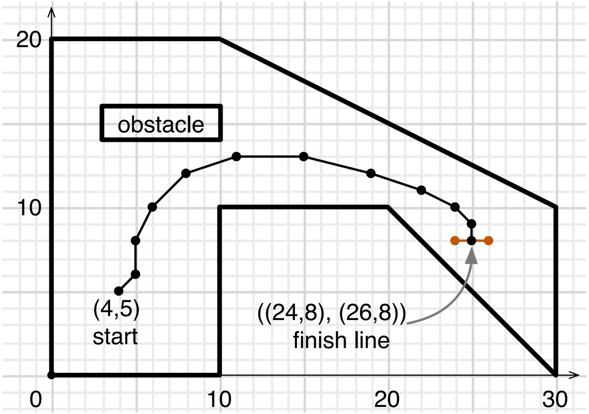 
Figure 1. An example of 2D racetrack problem.

### 2. State-variable representations
- `Representation 1`: state variables x, y for location, and u, v for velocity
  - Each state variable’s value is an integer
- `Representation 2`: state variables p and z: current location, current velocity
  - Each state variable’s value is a pair of integers
- `Representation 3`: one state variable s: current state
  - Value is a 4-tuple of integers

In each representation, the locations of the walls are rigid properties.

## Part 1: Comparing the FF heuristic with a domain-specific heuristic 
4 functions, `ff1`, `h_ff1`, `ff2`, `h_ff2`, were implemented for this part.

`ff1` returns a minimal relaxed solution for the racetrack problem `(s, f, walls)`, where `s` is the starting state and `f` is the finish line, and `(s, f, walls)` are represented in state variable representation 1. The relaxed solution returned by `ff1` is the same list [a1, a2,... , ak] that would be computed by the HFF algorithm (see algorithm 1). `h_ff1` calls `ff1`to get the minimal relaxed solution, and returns the total number of actions in it.

`ff2` and `h_ff2` were implemented similarly as `ff1` and `h_ff1`, with the phrase “state variable representation 1” replaced by
“state variable representation 2. 

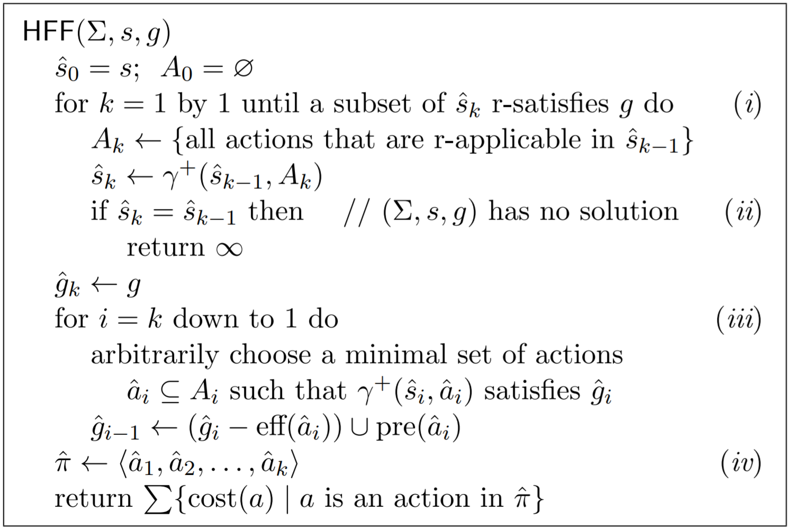 
Figure 1. HFF, an algorithm to compute the Fast-Forward heuristic    

A run of GBFS (Greedy Best-First Seearch) with `h_ff2` is shown in figure 2.

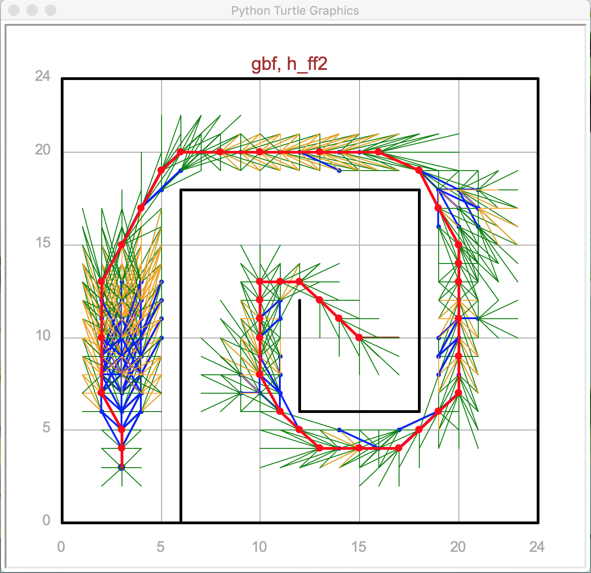 
Figure 2. A run of GBFS using `h_ff2`    

Dr. Nau provided two other heuritics in addition to `h_ff1` and `h_ff2`. Below is a one-sentence description for each of the 4 heuristics,

- `h_esdist`: returns the Euclidean distance from s to the goal, plus an estimate of how many moves it will take to stop
- `h_walldist`: returns a bfs distance from s to the goal, plus an estimate of how many moves it will take to stop
- `h_ff1`: returns the total number of moves from s to the goal computed by HFF under state-variable representation 1
- `h_ff2`: returns the total number of moves from s to the goal computed by HFF under state-variable representation 2

The performance of the 4 heuristics was evaluated under 2 metrics, one is the total CPU time for GBFS (Greedy Best-First Seearch) as a function of problem size, the other is the total number of nodes that GBFS generated as a function of problem size. See figure 3 & 4.

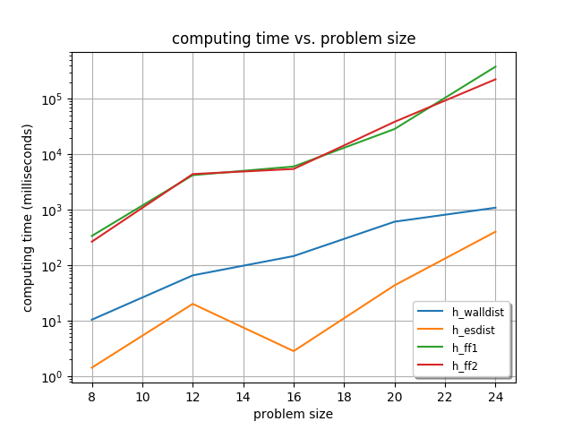 
Figure 3. The total CPU time for GBFS as a function of problem size    

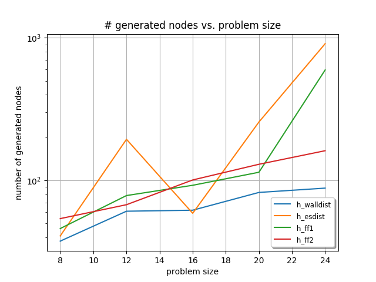 
Figure 4. The total number of nodes GBFS generated as function of problem size    

Figure 3 shows that h_ff1 and h_ff2 consume roughly the same amount of CPU time, while h_walldist and h_esdist are much faster. Figure 4 shows that h_ff1 and h_ff2 lead GBFS to generate about the same number of nodes, fewer than h_esdist but more than h_walldist.

## Part 2:
In this part two stochastic shortest-path (SSP) algorithms were implemented to deal with the nondeterminism of the steering result. For the comparison to be interesting, I selected `LAO*` and `UCT` (see algorithms 2 & 3). `LAO*` is a combination of best-first search and dynamic programming; it generalizes `A*` and handles cyclic search spaces. Meanwhile, `UCT` is an example of online probabilistic planning technique; it is Monte Carlo Tree Search with a sampling strategy that allows to further explore promising actions and prune out rapidly inferior options.

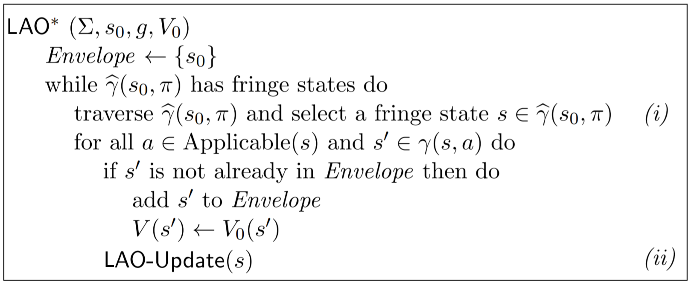 
Algorithm 2. LAO*, best-first search algorithm for cyclic domains

The LAO-Update procedure in algorithm 2 performs a VI-like series of repeated updates that are limited to the states on which the expansion of s may have an effect.

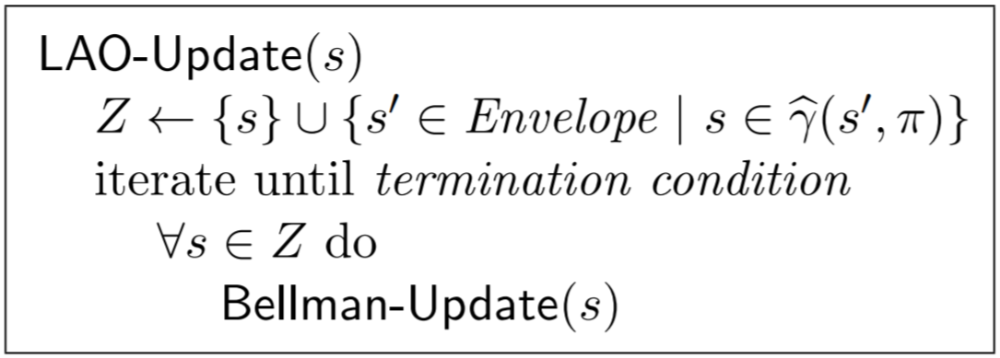 
  
Below is the UCT algorithm.

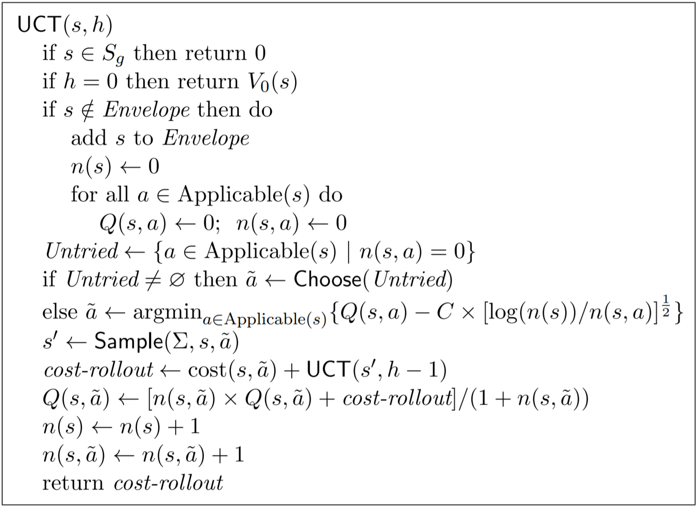 
Algorithm 3. A recursive UCT procedure

Both `LAO*` and `UCT` can use each of the 4 heuristics described in part 1, giving 8 possible combinations. To compare the performance of the two algorithms, `h_walldist` was used in all experiments.

The numbers of moves for LAO*/UCT to reach the goal are ploted against the amount of search time in figure 5 & 6.

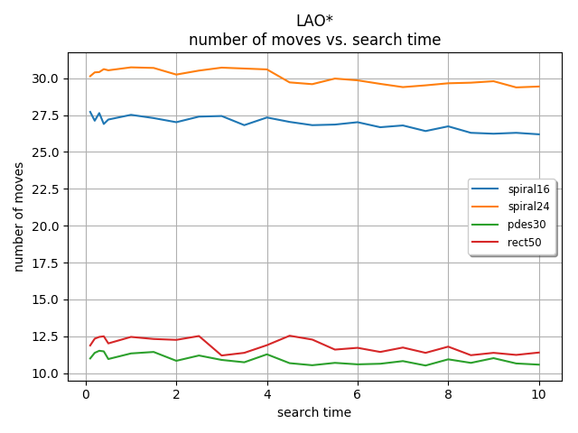 
Figure 5. Number of moves for LAO* to reach the goal as a function of problem size

 
Figure 6. Number of moves for UCT to reach the goal as a function of problem size

The probabilities of car accidents versus amount of search time are shown in figure 7 & 8.

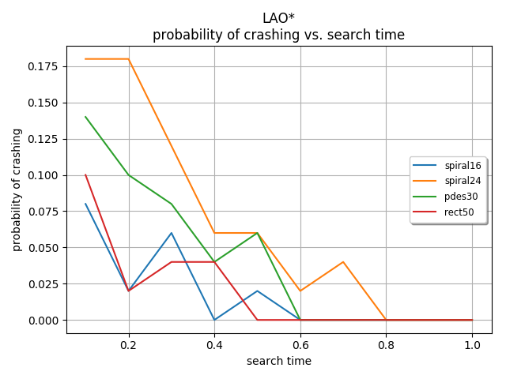 
Figure 7. Number of nodes that LAO* generated as a function of problem size

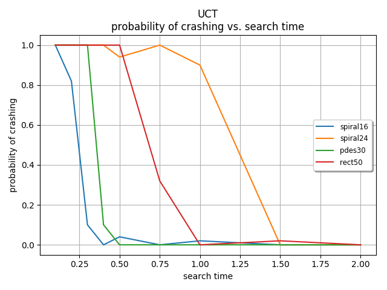 
Figure 8. Number of nodes that UCT generated as a function of problem size

### Author
[Fan Yang](mailto:fyang3@cs.umd.edu)

### Licence
Refer to `Licence` for more details.
